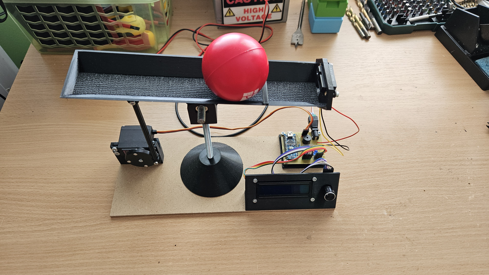
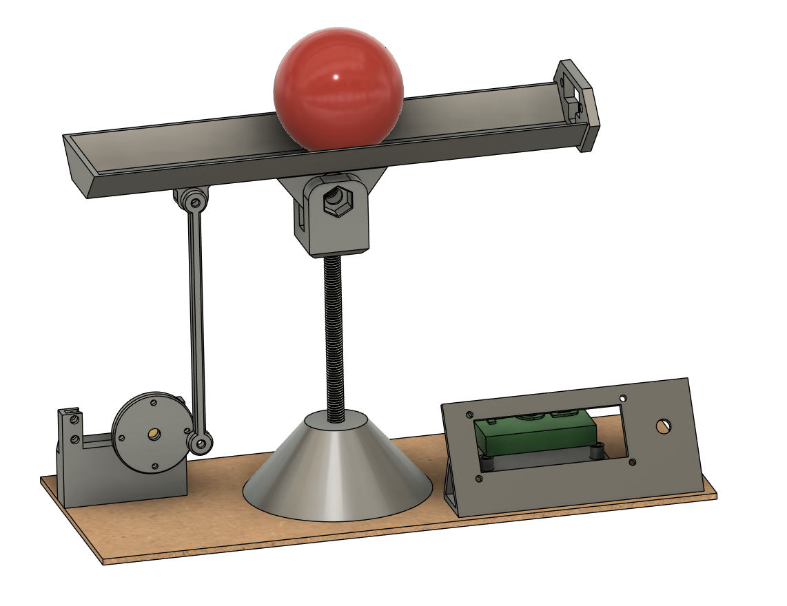
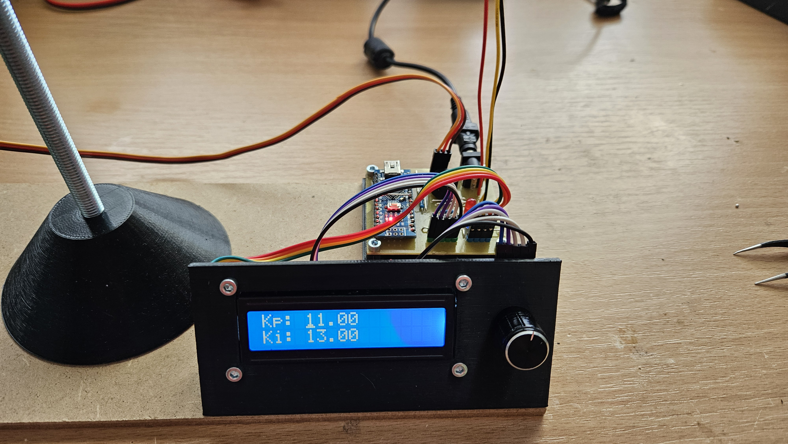
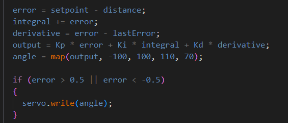

# 1D-Ball-Balancer

Made as part of Arcade Hack Club

Used github copilot when writing code and README

This project is and Arduino Nano based 1D Ball Balancer with a custom adjustable PID controller.
It uses the GP2Y0A41SK0F IR sensor to detect the position of the ball and a servo motor to balance it on a beam.

//////////////////////////// Video Link ////////////////////////////

## Components Used
- Arduino Nano
- GP2Y0A41SK0F IR sensor
- Mg996R Servo Motor
- 16x2 I2C LCD Display
- Rotary Encoder
- Buzzer
- 2 Leds with resistors
- 1 DC Jack
- 1 9V Battery/PSU
- Dupont wires
- Custom PCB (I milled mine using a CNC machine, but you can order it online)
- M8 threaded rod + nuts and locknuts
- Some M3 and M4 hardware
- M3 threaded inserts
- 3D printed parts
- 120x300mm MDF/HDF board

## How it works

The user can adjust the PID values using the rotary encoder and the LCD display.
The PID values are stored in the EEPROM so they are saved even after the power is turned off.

After pressing start in the LCD menu, the system will start balancing the ball using the provided PID values.
Balance mode can be exited by pressing the rotary encoder button.

## Tuning the PID values

1. Set all PID values to 0.
2. Increase the P value until the system starts oscillating back and forth.
3. Set all PID values to 0.
4. Increase the D value until the system is able to stop the ball from moving.
5. Set all PID values to 0.
6. Combine the P and D values.
7. Increase the I value until the system is able to balance the ball exactly in the middle.

